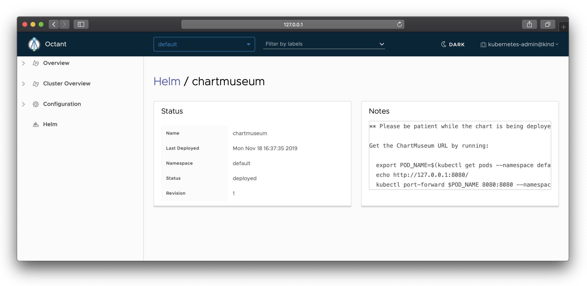

# Octant Helm Plugin

[](https://github.com/bloodorangeio/octant-helm/actions)

This is an [Octant](https://octant.dev/) plugin for [Helm](http://helm.sh/) which provides visibility into Helm releases installed on your Kubernetes cluster.

*Note: Plugin supports only Helm 3.0.0 or higher.*

## Install

Octant should first be installed (Helm is not necessarily required).

Please see the [releases](https://github.com/bloodorangeio/octant-helm/releases) page and find the correct `tar.gz` for your platform, then run the following (replacing URL):

```
mkdir -p ~/.config/octant/plugins/ && \
  curl -L https://github.com/bloodorangeio/octant-helm/releases/download/v0.2.0/octant-helm_0.2.0_darwin_amd64.tar.gz | \
  tar xz -C ~/.config/octant/plugins/ octant-helm
```

Then, in an environment authenticated against your Kubernetes cluster containing Helm releases, run `octant`.

You may also place the plugin binary elsewhere and run octant using the `--plugin-path=<path>` option.

## Screenshots

### List all releases

Equivalent of `helm list`.


### Show release summary

Equivalent of `helm status`.



## Uninstall

Run the following command to remove the plugin:

```
rm -f ~/.config/octant/plugins/octant-helm
```

## Development

Requires Go 1.17+ and [fswatch](https://github.com/emcrisostomo/fswatch).

Run `make dev` at the root of this repo, which will do the following:

- Build the binary
- Start the Octant server at http://127.0.0.1:7777
- Watch for file changes, rebuild binary, restart Octant, repeat

Contributions are welcome!
